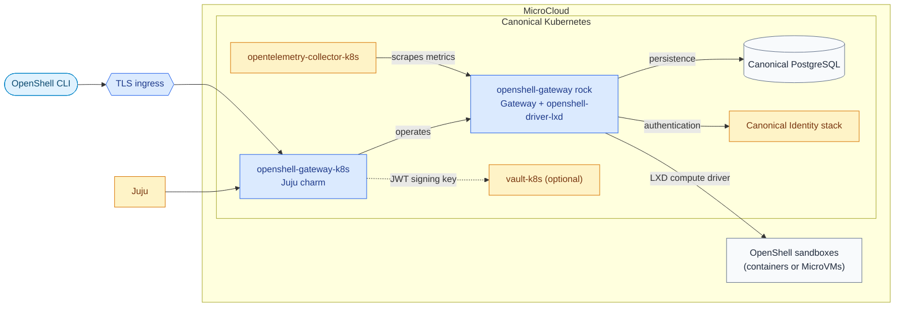

# Charmed OpenShell

This repository packages the [NVIDIA OpenShell](https://github.com/NVIDIA/OpenShell)
gateway for production-style operation on
[Canonical Kubernetes](https://ubuntu.com/kubernetes) with
[Juju](https://canonical.com/juju/).

The project combines OpenShell's control plane with Canonical's operator ecosystem.
It provides a secure, repeatable way to run the gateway, connect it to its supporting
services, and manage it through the same lifecycle as the rest of a Juju-managed
platform.

## What is included

- **Kubernetes charm** in [`charms/openshell-gateway-k8s/`](charms/openshell-gateway-k8s/)
  that deploys and manages the gateway workload using the companion
  [`openshell-gateway`](https://github.com/canonical/openshell-driver-lxd)
  rock (built and maintained externally).
- **Integration with platform services**, including
  [Canonical PostgreSQL](https://canonical.com/data/postgresql/docs/14) for persistence,
  the [Canonical Identity stack](https://canonical-identity.readthedocs-hosted.com/)
  for identity and login, Traefik for external access, and the
  [`opentelemetry-collector-k8s`](https://charmhub.io/opentelemetry-collector-k8s)
  for metrics, and optionally [`vault-k8s`](https://charmhub.io/vault-k8s) as the
  store for the gateway's token-signing key.
- **Documentation and architecture decisions** in [`docs/`](docs/) describing the
  solution and the important design choices behind it.
- **Automated checks and build workflows** in [`.github/workflows/`](.github/workflows/)
  for the charms.

## The solution at a glance

The OpenShell gateway is the central service for managing OpenShell sandboxes. In
this deployment, [Juju](https://canonical.com/juju/) operates the gateway on
[Canonical Kubernetes](https://ubuntu.com/kubernetes), and relations connect it to
the services it needs. Canonical Kubernetes runs on
[MicroCloud](https://canonical.com/microcloud). OpenShell uses the
`openshell-driver-lxd` compute driver to run sandboxes as either containers or
MicroVMs on MicroCloud.



Security is part of the default design: TLS is always enabled, unauthenticated
access is not supported, and the gateway requires both administrator and user roles
from the identity provider before it becomes ready.

## Getting started

To build the project locally, install the tools used by the repository:

- [Juju](https://canonical.com/juju/)
- [Canonical Kubernetes](https://ubuntu.com/kubernetes)
- [MicroCloud](https://canonical.com/microcloud)
- [Charmcraft](https://canonical-charmcraft.readthedocs-hosted.com/)
- Python 3.12, `tox`, and [`just`](https://github.com/casey/just)

Build the charm from the repository root:

```bash
just build-charm
```

Run the available tests:

```bash
just test-charm
```

Integration tests require a Juju controller and Kubernetes cluster. The
[`concierge.yaml`](concierge.yaml) file describes a local environment that can be
prepared with [Concierge](https://github.com/canonical/concierge):

```bash
sudo concierge prepare -c concierge.yaml
just integration-test-charm
```

The integration suite runs several modules. ``tests/integration/test_charm.py``
exercises the full control plane (PostgreSQL, Hydra, Traefik, and TLS). The rest can
be selected independently with pytest markers:

- ``tests/integration/test_lxd_integrator.py`` (``-m integrator``) uses the host LXD
  instance that Concierge already enables. It creates an integrator client identity,
  trusts it on the host LXD, and relates ``lxd-integrator-k8s`` to the gateway in the
  same Kubernetes model. It also covers both LXD project placements: the integrator
  naming no project, where the driver uses LXD's ``default``, and the integrator
  naming an isolated project, which is what a production deployment does.
- ``tests/integration/test_lxd_offer.py`` (``-m offer``) creates a machine model on the
  ``lxd`` cloud, deploys the ``lxd`` charm, offers its ``https`` endpoint, and consumes
  the offer from the Kubernetes model.
- ``tests/integration/test_observability.py`` (``-m observability``) relates
  ``opentelemetry-collector-k8s`` and asserts the gateway target is actually scraped.
- ``tests/integration/test_vault.py`` (``-m vault``) initialises, unseals and
  authorises ``vault-k8s``, then asserts the signing key migrates into it without
  changing, and that rotation goes through it.

Both provider paths assert the trust lifecycle: relating registers the gateway's client
certificate with the target LXD, and removing the relation withdraws it.

The ``lxd-integrator-k8s`` charm lives in
[its own repository](https://github.com/canonical/lxd-integrator-k8s); the suite
clones and packs it, or uses ``INTEGRATOR_CHARM_FILE`` / ``INTEGRATOR_CHARM_DIR``.

Sandbox end-to-end tests create real sandboxes and are off by default. Set
``OPENSHELL_ENABLE_SANDBOX_E2E=1`` to run them; they also probe the deployed driver
for ``--gateway-endpoint`` and skip when it is absent. The ``openshell`` snap they
drive has to match the gateway build in the rock — a newer CLI cannot decode the
gateway's responses.

### Observability

The charm provides a ``metrics-endpoint`` (``prometheus_scrape``) relation and opens
the port named by ``metrics-port`` (9090 by default; 0 disables the listener). The
workload's metrics endpoint is plain HTTP and unauthenticated — the gateway binary
offers no TLS or authentication for it — so it is reachable only inside the pod
network and is deliberately never routed through ingress. This is a bounded exception
to the charm's "TLS is always enabled" posture and applies to this endpoint alone.

Log forwarding (``loki_push_api``) and Grafana dashboards are not shipped yet.

### Credentials store

By default the gateway's Ed25519 token-signing keypair lives in a Juju application
secret. Relating the optional ``vault-kv`` endpoint to ``vault-k8s`` moves it into
Vault: on the first ready event the leader copies the keypair it already holds across,
so tokens held by running sandboxes keep verifying, and Vault is authoritative from
then on. ``rotate-jwt-signing-key`` follows whichever store is active, and
``get-gateway-status`` reports which one that is.

### LXD project

The LXD project sandboxes are created in is configured on ``lxd-integrator-k8s``
(its ``project`` option), not on this charm, and reaches the gateway over the
``lxd-https`` relation. The integrator also restricts the gateway's LXD trust entry
to that project, so the isolation is enforced by LXD rather than by the gateway
behaving itself. For production, give the integrator a project of its own.

## Where to look next

- Browse the [charm definition](charms/openshell-gateway-k8s/charmcraft.yaml) to
  see its configuration and service integrations.
- Read the [feature specifications](docs/spec/) for the reasoning behind the
  design.

## Contributing

Changes should preserve the secure-by-default behaviour and the Juju integration
model. Run the relevant build and test commands before opening a pull request.
Please report security issues privately using the process in
[SECURITY.md](SECURITY.md).

## License

This project is licensed under the [Apache License 2.0](LICENSE).
