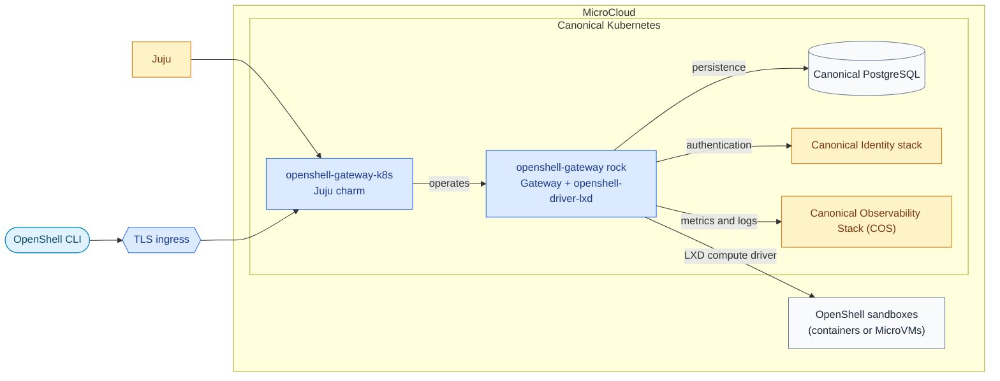

# Charmed OpenShell

This repository packages the [NVIDIA OpenShell](https://github.com/NVIDIA/OpenShell)
gateway for production-style operation on
[Canonical Kubernetes](https://ubuntu.com/kubernetes) with
[Juju](https://canonical.com/juju/).

The project combines OpenShell's control plane with Canonical's operator ecosystem.
It provides a secure, repeatable way to run the gateway, connect it to its supporting
services, and manage it through the same lifecycle as the rest of a Juju-managed
platform.

## What is included

- **Kubernetes charm** in [`charms/openshell-gateway-k8s/`](charms/openshell-gateway-k8s/)
  that deploys and manages the gateway workload.
- **OCI rock** in [`rocks/openshell-gateway/`](rocks/openshell-gateway/) containing
  the OpenShell gateway and the
  [`openshell-driver-lxd`](https://github.com/canonical/openshell-driver-lxd)
  compute driver in the same image.
- **Integration with platform services**, including
  [Canonical PostgreSQL](https://canonical.com/data/postgresql/docs/14) for persistence,
  the [Canonical Identity stack](https://canonical-identity.readthedocs-hosted.com/)
  for identity and login, Traefik for external access, and the
  [Canonical Observability Stack (COS)](https://documentation.ubuntu.com/observability/track-3.0/)
  for metrics and logs.
- **Documentation and architecture decisions** in [`docs/`](docs/) describing the
  solution and the important design choices behind it.
- **Automated checks and build workflows** in [`.github/workflows/`](.github/workflows/)
  for the charm and rock.

## The solution at a glance

The OpenShell gateway is the central service for managing OpenShell sandboxes. In
this deployment, [Juju](https://canonical.com/juju/) operates the gateway on
[Canonical Kubernetes](https://ubuntu.com/kubernetes), and relations connect it to
the services it needs. Canonical Kubernetes runs on
[MicroCloud](https://canonical.com/microcloud). OpenShell uses the
`openshell-driver-lxd` compute driver to run sandboxes as either containers or
MicroVMs on MicroCloud.



Security is part of the default design: TLS is always enabled, unauthenticated
access is not supported, and the gateway requires both administrator and user roles
from the identity provider before it becomes ready.

## Getting started

To build the project locally, install the tools used by the repository:

- [Juju](https://canonical.com/juju/)
- [Canonical Kubernetes](https://ubuntu.com/kubernetes)
- [MicroCloud](https://canonical.com/microcloud)
- [Charmcraft](https://canonical-charmcraft.readthedocs-hosted.com/)
- [Rockcraft](https://canonical-rockcraft.readthedocs-hosted.com/)
- Python 3.12, `tox`, and [`just`](https://github.com/casey/just)

Build the workload image and charm from the repository root:

```bash
just build-rock
just build-charm
```

Run the available tests:

```bash
just test-rock
just test-charm
```

Integration tests require a Juju controller and Kubernetes cluster. The
[`concierge.yaml`](concierge.yaml) file describes a local environment that can be
prepared with [Concierge](https://github.com/canonical/concierge):

```bash
sudo concierge prepare -c concierge.yaml
just integration-test-charm
```

The integration suite runs three modules. ``tests/integration/test_charm.py`` exercises
the full control plane (PostgreSQL, Hydra, Traefik, and TLS). The two LXD provider-path
modules can be selected independently with pytest markers:

- ``tests/integration/test_lxd_integrator.py`` (``-m integrator``) uses the host LXD
  instance that Concierge already enables. It creates an integrator client identity,
  trusts it on the host LXD, and relates ``lxd-integrator-k8s`` to the gateway in the
  same Kubernetes model.
- ``tests/integration/test_lxd_offer.py`` (``-m offer``) creates a machine model on the
  ``lxd`` cloud, deploys the ``lxd`` charm, offers its ``https`` endpoint, and consumes
  the offer from the Kubernetes model.

Both provider paths assert the trust lifecycle: relating registers the gateway's client
certificate with the target LXD, and removing the relation withdraws it. Sandbox end-to-end
tests in both modules are gated by a probe for the upstream ``--gateway-endpoint`` driver
flag and skip cleanly until that flag is available.

## Where to look next

- Browse the [charm definition](charms/openshell-gateway-k8s/charmcraft.yaml) to
  see its configuration and service integrations.
- Browse the [rock definition](rocks/openshell-gateway/rockcraft.yaml) to see how
  the gateway image is assembled.
- Review the [architecture decisions](docs/adrs/) for the reasoning behind the
  design.

## Contributing

Changes should preserve the secure-by-default behaviour and the Juju integration
model. Run the relevant build and test commands before opening a pull request.
Please report security issues privately using the process in
[SECURITY.md](SECURITY.md).

## License

This project is licensed under the [Apache License 2.0](LICENSE).
